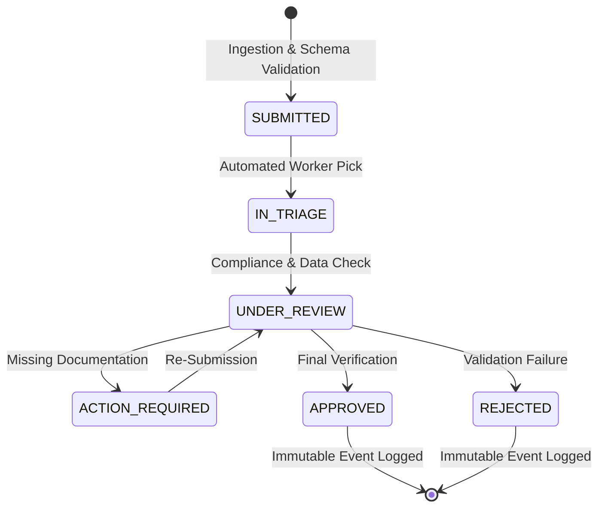
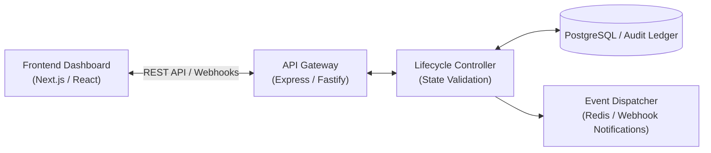

# 🔄 Status Tracking & Lifecycle Management Microservice

[](https://www.typescriptlang.org/)
[](https://nodejs.org/)
[](https://postgresql.org/)
[](https://docker.com)

An enterprise-grade, deterministic status tracking and case lifecycle management service. Designed for strict state machine enforcement, immutable audit logging, and high-frequency frontend synchronization across distributed dashboard systems.

---

## 🏛️ Architecture & State Lifecycle





---

## ✨ Key Capabilities

1. **Finite State Machine (FSM) Enforcement:** Guarantees that records only progress through mathematically valid, compliant state transitions.
2. **Immutable Audit Ledger:** Every state change records an append-only audit trail with actor ID, timestamp, transition metadata, and cryptographic hash verification.
3. **High-Performance Database Sync:** Connection pooling and indexed historical queries optimized for low-latency dashboard polling and webhook dispatches.
4. **Strict TypeScript & Schema Validation:** Zero runtime type errors with end-to-end Pydantic/Zod input validation.

---

## 🛠️ Tech Stack

- **Runtime & Language:** Node.js, TypeScript (Strict Mode), Express / Fastify
- **Data Persistence:** PostgreSQL, Prisma ORM, Redis
- **Security & Validation:** Zod schema validation, JWT auth, HMAC webhook signatures
- **DevOps:** Docker, Docker Compose, GitHub Actions CI/CD

---

## ⚡ Quick Start

```bash
# Clone the repository
git clone git@github.com:yevhens-hue/job-tracker-service-NDA.git
cd job-tracker-service-NDA

# Install dependencies
npm install

# Run in development mode
npm run dev

# Production build
npm run build && npm start
```

---

## 👨‍💻 Author & Engineering
- **Author:** [Yevhen Shaforostov](https://github.com/yevhens-hue)
- **Role:** AI Product Manager & Full-Stack AI Engineer at [Adsy.com](https://adsy.com)


<!-- activity-sync: 2026-08-28 -->


<!-- activity-sync: 2026-08-28 -->


<!-- activity-sync: 2026-08-29 -->
